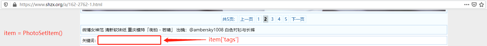
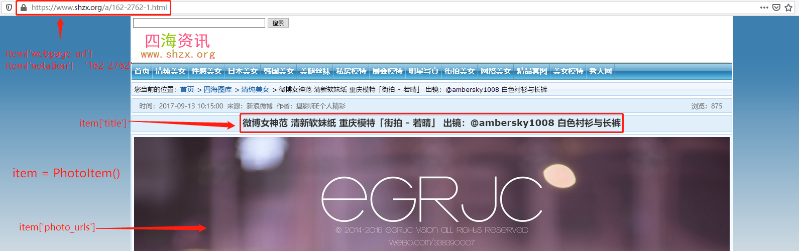
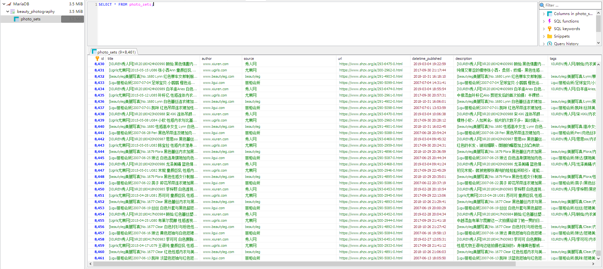
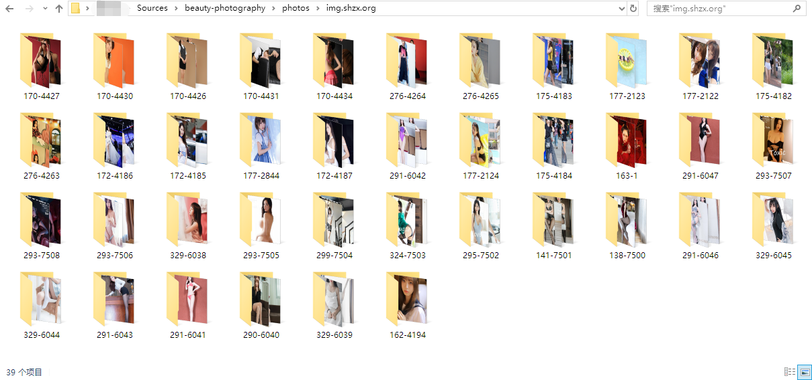

# beauty-photography
爬虫习作 Nr. 2: 以佳丽摄影作品网站为目标的定向爬取 

## 目标
爬取四海资讯图库 (https://www.shzx.org/b/12-0.html) 的图集信息以及图片


## 技术栈
主要是Scrapy结合SQLAlchemy. Scrapy爬取网页内容并提取出项目(Item), SQLAlcehmy将项目存储在数据库

## 项目结构
```
.
├── logs
│   └── 2019-11-16.log
├── photos
│   └── img.shzx.org
│       ├── 138-7500
│       │   ├── 138-7500-1573929540.webp
│       │   └── 138-7500-1573929818.webp
│       ├── 141-7501
│       │   ├── 141-7501-1573929546.webp
│       │   └── 141-7501-1573929587.webp
│       └── 162-2550
│           ├── 162-2550-1573929592.jpg
│           └── 162-2550-1573929596.jpg
├── README.md
├── scraper
│   ├── database.py
│   ├── __init__.py
│   ├── items.py
│   ├── middlewares.py
│   ├── pipelines.py
│   ├── __pycache__
│   ├── settings.py
│   └── spiders
│       ├── __init__.py
│       ├── photo.py
│       ├── photoset.py
│       └── __pycache__
├── scrapy.cfg
```
- `logs`文件夹存放爬虫的运行日志  
- `photos`文件夹存放爬虫下载的图片
- `scraper`文件夹存放爬虫的主要代码
- `scraper/database.py`文件定义了数据库包含的表以及各个表的结构
- `scraper/spiders/photo.py`文件定义了用于爬取图片的`PhotoSpider`类
- `scraper/spiders/photoset.py`文件定义了用于爬取图集信息的`PhotoSetSpider`类

## 代码组织 - One Item, One Spider, One Pipeline
```
因为本项目旨在完成图集信息入库以及图片下载这两项工作, 所以作者为该两项工作分别配备一个项目, 一只蜘蛛, 一条管道. 具体而言, 即:
爬取图集(photoset) = PhotoSetItem + PhotoSetSpider + PhotoSetPipeline
爬取图片(phot) = PhotoItem + PhotoSpider + PhotoPipeline
```

## 蜘蛛的职责
- PhotoSetSpider: 爬取图集信息


- PhotoSpider: 爬取图片


## 其他细节
- 使用ORM的方式插入图集信息到数据库中
```python
class PhotoSetPipeline(object):
    def process_item(self, item, spider: Spider):
        record = PhotoSet(
            url=item['url'],
            title=item['title'], 
            author=item['author'],
            source=item['source'], 
            datetime_published=item['datetime_published'],
            description=item['description'],
            tags=item['tags'])
        self.session.add(record)
        self.session.commit()
```
- 在下载图片的请求中加入Referer首部, 降低图片下载失败的概率
```python
class PhotoPipeline(ImagesPipeline):
    def get_media_requests(self, item: PhotoItem, info):
        for photo_url in item['photo_urls']:
            yield Request(photo_url, meta={'name': item['notation']}, headers={'Referer': item['webpage_url']})
```


## 运行结果
- 爬取图集

- 爬取图片


未曾尝试全站爬取, 图示结果仅供参考


## 存在的缺陷
- 有时出现下载图片失败的情况


## 要做的改进
- 提升爬取效率
- 提升入库速度
- 提升图片下载的成功率


## 可能会做的扩展
- 添加其他目标网站, 例如妹子图 (https://www.jdlingyu.mobi/collection/meizitu), 新闻吧 (https://www.jdlingyu.mobi/collection/meizitu) 等. 爬取不同的网站, 重用相同的Items
- 分布式
- etc.
